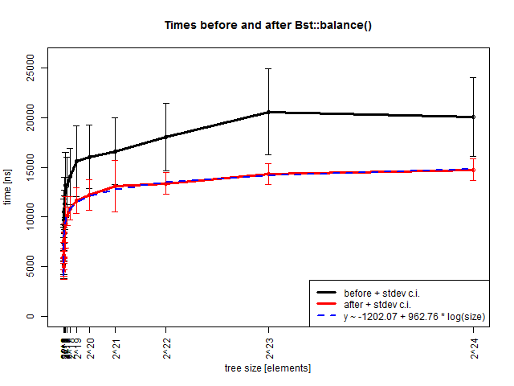
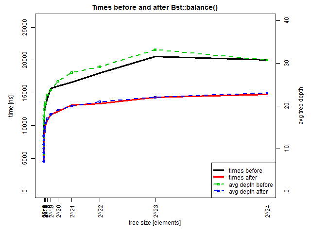

# Report: Binary Search Tree

In this report the `c++` implementation of a templated Binary Search Tree class `Bst` is described.

A binary search tree is a data structure that allows fast search, insertion and deletion of items
because of its particular binary behavior:

- each node has a key (and eventually a value associated with it) and can have two children nodes,
called left and right which by recursion can be two entire subtrees;
- the key in each node must be greater than to any key stored in the left sub-tree, and less than
  any key stored in the right sub-tree.

The concept can be generalized and adapted for any order relation (total or weak) between the keys.

```
       9
      / \
     5   10
    / \
   2   6

```
> An example of Bst


## The code implementation

The code implementation is composed of two main parts: 
- the header file **btree.h** defines the class `Bst` and its methods and fields as well as the `Node` class
	that is the object type that the Bst will handle;
- the source file **btree.cc** in which the longer member functions are implemented.

Another ancillary file has also been created:
- **except.h** defines the exceptions that the `Bst` could throw;

### The `Bst` class

The `Bst` class is **templated** according to the following pattern:

```c++
template <typename K, typename V, class C = less<K>>
```

where:
- `K` is the type of the keys i.e. the objects on which the ordering is imposed
- `V` is the type of values stored in each node
- `C` is the type of a comparator class which is used to define the ordering of nodes according to their keys;
	in this implementation it is defaulted to `std::less<K>` which will cause nodes with smaller keys to be
	inserted on the left side while node with greater keys to be inserted on the right side.

The class has the following **members**:
- `root` a unique pointer to the root Node
- `comp` a local instance of type C used for the comparisons

The class also includes other inner types:
- the `Node` class
- the `Iterator` and `ConstIterator` classes
- the `KVstruct` structure

#### The `Node` class

This **public** class defines the backbone object of the tree structure.
Being an inner class it inherits the templated pattern of the tree it is part of.
It consists of 4 `protected` **members**:

- a `std::pair<K,V>` named `pair` that holds the key and the value associated with the node;
- a `left` and a `right` `std::unique_ptr<Node>` that will hold the pointers to the left and right children;
- a `Node*` member called `prev` that holds a pointer to the parent node (this is useful for the
  tree-traversal process).

The `Node` object has an ordinary **constructor** that takes a `std::pair<K,V>` structure to initialize its key
and value and a **copy-constructor** which is properly built to recursively produce a copy of its children.

The public **read-only** access to the protected members is guaranteed by the following methods:
`getkey(), getvalue(), getpair(), getleft(), getright(), getparent()`.
What they do is self explanatory.

#### The `Iterator` and `ConstIterator` classes

The Iterator class implements the following operators:
- `N* operator*() const`
- `Iterator& operator++()` and `Iterator operator++(int)`
- `bool operator==(const Iterator& rhs)` and `bool operator!=(const Iterator& rhs)`

These allow a complete in-order traversal of the tree.

The `ConstIterator` class inherits from the `Iterator` class and, as the name suggests, works as the
**const** counterpart.

#### The `KVstruct` structure

the KVstruct is a simple structure that wraps around the given comparison class `C` defining the operator
```c++
bool operator()(const std::pair<K,V>& lhs, const std::pair<K,V>& rhs)
```
This structure can be used as a comparator in the `std` library function such as `std::sort`.

#### The Bst class methods

- `insert(std::pair<K,V>)`: the function adds a new Node to be built with the given key-value pair,
	the function uses the recursive function `insertSingle` which proceeds down the tree (according
	to given the comparator) to reach the correct position for insertion.
	If the key is already present in the tree, the function resets the value to the new value.
- `depth`: the function returns a `size_t` with the maximal depth of the tree. The function has two overloads:
  - `depth(const Node* node)` the function works recursively by calling itself on the node left and right pointers;
	  choosing a particular node, the function will return the maximum depth of the subtree rooted in that node
  - `depth()` this calls the previous overload using the root node as the argument.
- `size()` the function returns the size of the tree. It uses `internalsize` recursively on each child.
- `clear()`: this function deletes all the nodes. The destructor calls this function.
- `print()`: the function which prints out the tree traversing it using the ConstIterator. The keys are printed in order.
- `detailedPrint()`: this function, similar to `print()` also prints the children and the parent for each node.
- `balance()`: this function which balances the tree. The function proceeds by first collecting the key-value pairs by
	traversing the tree through a ConstIterator, it then clears the existing nodes; the tree is then filled again with
	the help of the recursive function `insertSorted` which takes advantage of the fact that the keys are traversed in-order
	and this drastically improves the performance when compared with the function `insertSingle`.
- `checkBalanced()`: the function checks if the tree is balanced by recursively using the private function `checkBalancedInternal`.
- `find(K)`: the function returns an Iterator to the node with the given key. This function proceeds recursively from
	the root node descending the tree according to the given comparator until the correct node is found.
    If they key is not present, the `Iterator{nullptr}` is returned.
- `cfind(K)`: the function is the constant counterpart if `find` and returns a `ConstIterator`.
- `erase(K)`: the function which deletes the node with the given key. If the node with the given key is not present,
	a `NotFoundException` is thrown.
- subscript `operator[](K)` (const and non-const): these functions return the value associated with the given key.
	If the non const overload doesn't find the corresponding node, a new one is created with the given key.
	The const overload, on the other hand, will throw a NotFoundException is the corresponding node can't be found.
	


## Testing

Testing is performed in two phases:

1. Generic testing (**testingmain.cc**): all the most important functions are called, in particular:

    - the *constructor*, *destructor* and *copy-move* sematics;
    - the `print` and `detailedprint` functions;
    - the `depth` and `averagedepth` functions
    - the `find` function and the `[]` (subscript) operators;
    - the `balance` and `checkbalanced` function;
    - the `clear` function;

	these implicitly allow to test the other internal functions.

2. Time complexity testing (**timingmain.cc**): the performance of the `find()` function is measured.

The file **misc.h** defines a couple of methods used for testing (custom comparator and random number generator).
The code, run under **valgrind**, shows that the memory management is carried out correctly.

### Run

The file **testingmain.cc** has been compiled with the option -D DEBUG, that allows some important functions to
print to screen when the execution passes through them: this way we can check that the correct methods are called
like, for example, the correct semantic (*copy* or *move*).

The code revolves around a tree built with this unordered array of keys (10, 79, 13, 80, 60, 50).

The functions described above are tested and work as intended.

```
       13                      50
      /  \      balance()     /   \
     10   79       ==>      10     79
          / \                \    /  \
         60  80              13  60   80
         /				   
        50				   
```
> Graphical representation of one of the operations performed during the tests.

As a further step, a custom comparison is implemented (`mycomparison` in **misc.h**). The implemented comparator
is the inverse order relation that `std::less<K>` gives.

The results printed by the program show the correct
handling of the custom comparator.


### Time complexity

The file **timingmain.cc** pertains the performance testing of the `find` function. The code proceeds as follows:

- trees of **2^8^** to **2^24^** nodes are generated
- for each size the tree is built from a randomly shuffled (`std::shuffle`) vector of type `size_t` containing all the
  numbers from **0** to **size-1**
- then 100 key picked randomly in the range **0..size-1**
- for each key the `find(key)` function is called and the elapsed time in nanoseconds for each call is recorded
- the balance function is then called
- the `find(key)` function is issued again for the same keys as before and times are recorded
- together with the times, also the maximum depths and the average depths are written to file.

The time is measured using `std::chrono::high_resolution_clock:now()`.

A run of the program produces the file **times.txt** which contains csv data that produces 
a table of this fashion:

| exp  | prepost  | depth  | avgdepth  | val1  | val2 | ... | val100 |
|---:|:---:|---:|---:|:---:|:---:|:---:|:---:|
| 8 | 0 | 15  | 8.69  | 7698  |  3421 | ...  | 3849 |
| 8 | 1 |  9 |  7.04 | 5132 |  5132 | ...  | 4704 |
| 9 | 0 |  21 |  10.8 | 2994  | 3849  | ...  | 7698 |

An R script has been setup for the purpose of processing the gathered data:
means and standard deviations of the measured times are calculated for each condition (size, balancing).

The graphs below are produced as a result.


> Comparison of times elapsed by each call of `find`

The graph above shows the different performance of the Bst before and after calling the `balance` function.
The average times are plotted together with +/- std dev intervals.

As can be seen, before balancing the tree the times are on average higher and more variable (the black line). This is
the expected behaviour. It should be noted that the worst case performance on an unbalanced Bst is `O(N)`: this
can happen in few highly pathological cases (the Bst collapses into a list).
In our case the Bst is generated randomly: the pathological case is unlikely and the trend resembles a
logarithmic function.

After balancing the tree, the performance improves and is less variable (red line). The behavior is clearly
`O(logN)`. As a test, the best fitting logarithmic law is calculated and plotted (blue line).
The match is very good.

The dependence of the behavior on the average tree depth is investigated below.


> The mean times are plotted and compared with the average tree depth for each case

For the sake of completion, the plot above shows the trend of mean times together with the average depths.
As can be expected the times and the depths show the same qualitative trend. The scale of representation
is set on purpose to mark the correspondence.
